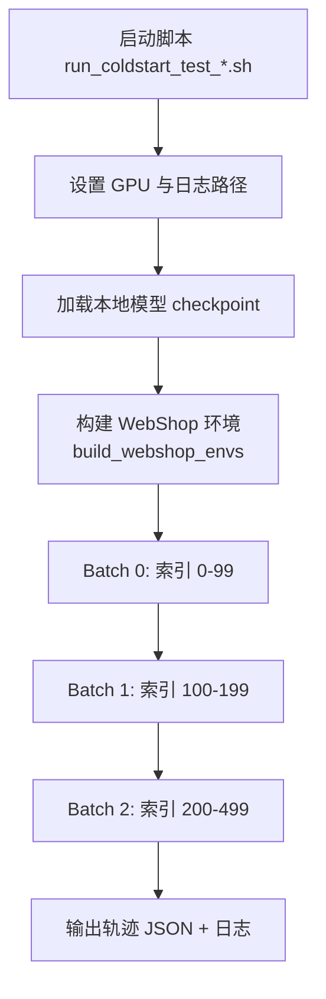
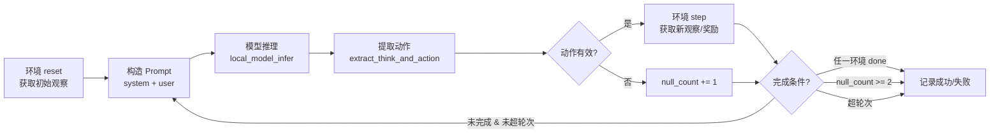
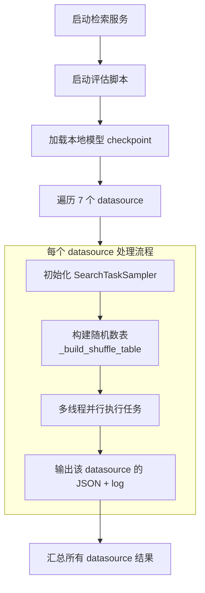
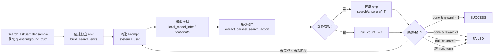

# 使用文档 — Coldstart 评估（Eval）流程

本文档介绍 **WebShop** 和 **Search** 两个任务的冷启动（Coldstart）评估流程，包括启动方式、参数配置、输出说明等。

---

## 项目结构概览

```
verl-agent/
├── eval_webshop/                          # WebShop 任务评估
│   ├── coldstart_test_new_for_g5n1/       # 主实验目录（g5n1 配置）
│   │   ├── run_coldstart_test_1.5B_hislen8_e3.5_v2.sh
│   │   ├── run_coldstart_test_1.5B_hislen8_e5_v2.sh
│   │   ├── run_coldstart_test_1.5B_hislen8_base.sh
│   │   ├── coldstart_para_his_test_1.5B_hislen8_epoch3.5_v2.py
│   │   ├── coldstart_para_his_test_1.5B_hislen8_epoch5_v2.py
│   │   ├── coldstart_para_his_test_1.5B_hislen8_base.py
│   │   ├── log/                          # 运行日志
│   │   ├── model_hislen8_result_v2/      # 输出结果
│   │   └── 验证总结.md
│   └── coldstart_test_for_g1n5/           # 早期实验目录（g1n5 配置）
│
├── eval_search/                           # Search 任务评估
│   ├── coldstart_test_search_seed1_rl_action_modified_seed1/  # 主实验（seed=1）
│   │   ├── coldstart_search_local_3.5epoch_rl_multithread_0.80.sh
│   │   ├── coldstart_search_local_3.5epoch_rl_multithread_0.90.sh
│   │   ├── coldstart_search_local_3.5epoch_rl_multithread_noemb.sh
│   │   ├── coldstart_search_local_3.5epoch_without_rl.sh
│   │   ├── test_search_local_3.5epoch_rl_0.80.py
│   │   ├── test_search_local_3.5epoch_rl_0.90.py
│   │   ├── test_search_local_3.5epoch_rl_noemb.py
│   │   ├── test_search_local_3.5epoch_without_rl.py
│   │   ├── log/                          # 运行日志
│   │   ├── test_emb_080/                 # emb=0.8 输出
│   │   ├── test_emb_090/                 # emb=0.9 输出
│   │   ├── test_noemb/                   # 无 emb 输出
│   │   ├── test_emb_3.5epoch_without_rl-1/
│   │   ├── test_emb_3.5epoch_without_rl-2/
│   │   └── seed1结果.md
│   ├── coldstart_test_search_seed1_rl/        # seed=1, RL 实验
│   ├── coldstart_test_search_seed1_1325sample/ # seed=1, 1325 样本
│   ├── coldstart_test_search_seed1_rl_action_modified_seed11/  # seed=11
│   ├── coldstart_test_search_seed1_rl_action_modified_seed21/  # seed=21
│   ├── coldstart_test_search_seed1_rl_action_modified_resume/  # resume 实验
│   ├── coldstart_test_search_seed1_rl_action_modified_resume_seed11/
│   ├── coldstart_test_search_seed1_sft/       # SFT 基线
│   ├── coldstart_test_search_500sample/       # 500 样本实验
│   ├── coldstart_test_search_lr1e-5/          # 不同学习率
│   └── coldstart_noemb_bs4_test/              # 无 emb, bs=4
```

---

## 1. WebShop 任务评估

### 1.1 启动脚本详解

**示例脚本路径**：`eval_webshop/coldstart_test_new_for_g5n1/run_coldstart_test_1.5B_hislen8_e3.5_v2.sh`

```bash
#!/bin/bash
set -e

BASE_PATH="$(dirname "$(realpath "$0")")"
export PYTHONPATH=$BASE_PATH:$PYTHONPATH
export PYTHONUNBUFFERED=1

# 设定 GPU 编号
LOG_FILE="$BASE_PATH/log/Webshop_test_e3.5_hislen8_v2_$(date +%Y%m%d_%H%M%S).log"
export CUDA_VISIBLE_DEVICES=5
echo "GPU: $CUDA_VISIBLE_DEVICES"
echo "Log: $LOG_FILE"

nohup python3 $BASE_PATH/coldstart_para_his_test_1.5B_hislen8_epoch3.5_v2.py \
    --model "/path/to/checkpoint" \
    --seed 42 \
    --sequential true \
    > $LOG_FILE 2>&1 &
echo "Test started. PID: $!"
tail -f $LOG_FILE
```

#### 参数说明

| 参数 | 说明 |
|------|------|
| `--model` | **必填**。本地模型 checkpoint 路径，指向 HuggingFace 格式的模型目录 |
| `--seed` | 随机种子，控制任务的采样顺序（默认 `42`） |
| `--sequential` | 是否顺序获取测试目标（默认 `true`）。接受 `true`/`false`（不区分大小写），经 `lambda x: x.lower() == 'true'` 解析为布尔值后传入 `build_webshop_envs(sequential=...)`。`true` 表示按索引顺序不重复采样（seed 不影响索引顺序）；`false` 表示改用随机采样 |

#### 环境配置

| 配置项 | 位置 | 说明 |
|--------|------|------|
| `CUDA_VISIBLE_DEVICES` | 脚本头部 | 指定使用的 GPU 编号 |
| `LOG_FILE` | 脚本头部 | 日志输出路径，自动以时间戳命名 |
| `nohup ... &` | 脚本主体 | 后台运行，避免终端关闭中断 |

### 1.2 主程序核心参数

主程序 `coldstart_para_his_test_1.5B_hislen8_epoch3.5_v2.py` 中的 `__main__` 部分集中管理超参数：

```python
max_turns = 50          # 每问最大搜索/购物轮数
HIS_LEN = 8             # 历史窗口长度（-1 表示使用全部历史）
group_n = 5             # 并行组数
env_num = 1             # 每组环境数
num_para = 5            # 每轮最大并行动作数
prompt = 3              # Prompt 模板版本
```

### 1.3 采样机制

WebShop 评估使用 `build_webshop_envs` 构建的 `WebshopMultiProcessEnv`（位于 `agent_system/environments/env_package/webshop/envs.py`），其采样由 `split`、`seed`、`sequential`、`exclude` 四个参数共同控制。

#### split — 确定目标索引范围

`split` 参数决定从全部 goal 列表中选取哪些索引：

| split | 索引范围 | 说明 |
|-------|---------|------|
| `test` | `range(500)` | 前 500 条，用于冷启动评估 |
| `eval` | `range(500, 1500)` | 验证集 |
| `train` | `range(1500, len(goals))` | 训练集 |
| `sft` | `range(600, len(goals))` | SFT 微调用 |

#### 采样模式

`build_webshop_envs` 接收 `seed`、`sequential`、`exclude` 三个参数：

| 模式 | 触发条件 | 行为 |
|------|---------|------|
| **顺序采样** | `sequential=True` | 按 `_goal_idx_counter` 计数器顺序递增取索引，每次取 `env_num` 个，不重复。**seed 不影响索引顺序** |
| **不重复随机** | `exclude=True`（默认） | 用 `seed` 初始化的 RNG 随机抽取，`_used_goal_idxs` 记录已用索引，避免重复 |

#### 当前评估配置

冷启动评估采用 `sequential=True` 顺序模式，`sequential` 值来自命令行参数 `--sequential`（由 `.sh` 脚本传入 `--sequential true`）：

| 配置项 | 值 |
|--------|-----|
| `build_webshop_envs` 参数 | `split='test', seed=seed, exclude=True, sequential=sequential` |
| `sequential` 来源 | 命令行参数 `--sequential`（默认 `true`），由 `evaluate_coldstart_data(..., sequential=args.sequential)` 传入 |
| 数据来源 | `~/data/items_shuffle_1000.json` |
| 目标索引范围 | `0–499`（共 500 个） |
| 采样方式 | 顺序不重复，seed 不参与索引排序 |
| 运行方式 | 主程序 `__main__` 中分 3 批顺序执行（每批调用 `evaluate_coldstart_data` 时均传入 `sequential=args.sequential`） |

> 注意：修改为随机采样时，只需将脚本中的 `--sequential true` 改为 `--sequential false`，无需改动 Python 代码。

**分片规则**（主程序 `__main__` 内硬编码）：

| 批次 | 索引范围 | 样本数 |
|------|----------|--------|
| Batch 0 | 0–99 | 100 |
| Batch 1 | 100–199 | 100 |
| Batch 2 | 200–499 | 300 |

每批输出文件通过 `get_unique_filename()` 自动去重，如 `1.5B_epoch3.5_hislen8_test_v2.json` → `1.5B_epoch3.5_hislen8_test_v2_1.json`。

#### `get_unique_filename()` 对 json / log 的覆盖性

每批运行会生成 3 类文件，文件名均由 `output_file`（去重后的 `.json`）推导：

| 文件 | 命名方式 | 是否参与 `get_unique_filename` 去重 |
|------|----------|------------------------------------|
| 主轨迹 | `output_file`（`.json`） | ✅ **参与**：已存在则自动 `_1`、`_2`… 递增 |
| 运行日志 | `output_file.replace('.json', '.log')` | ❌ 不参与：跟随 json 名（去重后同步为新名） |
| 分离数据 | `output_file.replace('.json', '_test_seperated.json')` | ❌ 不参与：跟随 json 名 |

**覆盖性结论**：

- **json 永不覆盖**：只要目标 `.json` 已存在（无论是上次完整结果还是残留文件），`get_unique_filename` 都会生成 `_1`、`_2`… 的新文件名，不会覆盖历史数据。
- **log 正常情况下不会被覆盖**：log 名跟随去重后的 json 名。当 json 因去重获得新名时，log 也随之换名，不会覆盖已有日志。
- **log 唯一会被覆盖的场景（中断恢复）**：当 **json 不存在但 log 已存在**时（即上次运行中断、只写了 log 未生成 json），程序检测到该情况会 **主动删除该不完整 log** 并从零开始重建，避免残留不完整日志误导统计。
- 因此，中断后重新运行 **不会污染** 之前的完整结果；但如果上一次中断留下了一个**只有 log 没有 json** 的残留，该 log 会被当作不完整产物删除重建。

### 1.4 输出说明

运行完成后在 `model_hislen8_result_v2/` 目录下生成：

| 文件 | 说明 |
|------|------|
| `*.json` | 全部轨迹数据（含成功+失败） |
| `*_success.json` | 仅成功轨迹 |
| `*.log` | 运行日志，含每任务状态、耗时、成功率统计 |

### 1.5 运行流程



每个任务（每批内）的交互流程：



---

## 2. Search 任务评估

### 2.1 前置依赖

Search 评估需要额外启动一个 **检索/搜索服务**：

```bash
# 启动检索服务（默认端口 8000）
bash coldstart_genaration_search/retrieval_launch.sh

# 可使用自定义端口，修改环境变量 PORT
PORT=8010 bash coldstart_genaration_search/retrieval_launch.sh
```

### 2.2 启动脚本详解

**示例脚本路径**：`eval_search/coldstart_test_search_seed1_rl_action_modified_seed1/coldstart_search_local_3.5epoch_rl_multithread_0.80.sh`

```bash
#!/bin/bash
set -e

BASE_PATH="$(dirname "$(realpath "$0")")"
export PYTHONPATH=$BASE_PATH:$PYTHONPATH
export PYTHONUNBUFFERED=1

LOG_FILE="$BASE_PATH/log/test_search_0.80_$(date +%Y%m%d_%H%M%S).log"
export CUDA_VISIBLE_DEVICES=5
echo "GPU: $CUDA_VISIBLE_DEVICES"

nohup python3 $BASE_PATH/test_search_local_3.5epoch_rl_0.80.py \
    --model "/path/to/checkpoint" \
    --json_output_dir $BASE_PATH/test_emb_080 \
    --seed 1 \
    > $LOG_FILE 2>&1 &

echo "Started. PID: $!"
echo "Log: $LOG_FILE"
tail -F $LOG_FILE
```

#### 参数说明

| 参数 | 说明 |
|------|------|
| `--model` | **必填**。本地模型 checkpoint 路径 |
| `--json_output_dir` | **必填**。JSON 输出目录 |
| `--seed` | **必填**。随机种子（`<0` → 顺序采样，`>=0` → 随机采样） |

### 2.3 主程序核心参数

主程序 `test_search_local_3.5epoch_rl_0.80.py` 中的超参数：

```python
# 模型推理
ds_model = 1          # DeepSeek 模型: 1=Flash, 2=Pro
effort = 1            # DeepSeek thinking: 0=disabled, 1=high, 2=max

# 环境交互
max_turns = 15        # 每问最大搜索/回答轮数

# 历史窗口
his_len = 8           # 上下文历史窗口长度 (-1=使用全部历史)

# 并行探索设置
group_n = 5           # 并行组数
env_num = 1           # 每组环境数
num_para = group_n    # 每轮最大并行动作数

# 检索服务配置
PORT = 8010           # 检索服务端口
SEARCH_URL = f'http://127.0.0.1:{PORT}/retrieve'
SEARCH_TOPK = 3       # 每次搜索返回 top-k 文档数
SEARCH_TIMEOUT = 90   # 搜索请求超时时间（秒）

# 线程池
MAX_WORKERS = 1       # 线程数（本地模型推荐 1~4，API 推荐 8~16）
```

### 2.4 采样机制

Search 评估使用 `SearchTaskSampler` 在外部实现采样逻辑，通过 `--seed` 控制采样方式。每个 datasource 独立初始化 sampler 并构建随机数表。

| 配置项 | 说明 |
|--------|------|
| 数据来源 | `~/data/searchR1_processed_direct/test.parquet` |
| 总样本数 | 1,325（7 个 datasource 合计） |
| 采样方式 | `seed < 0` → 顺序采样；`seed >= 0` → 随机采样（用 seed 初始化 RNG 构建随机数表） |
| 运行方式 | 遍历 7 个 datasource，每个 datasource 内通过多线程并行执行任务 |

**分片规则**（按 datasource 分段，每段从各自行范围中随机抽取固定数量）：

| Datasource | 类型 | 行索引范围 | 总行数 | 每段采样数 |
|------------|------|-----------|--------|-----------|
| nq | in-domain | 0–3,609 | 3,610 | 200 |
| triviaqa | out-of-domain | 3,610–14,922 | 11,313 | 200 |
| popqa | out-of-domain | 14,923–29,189 | 14,267 | 200 |
| hotpotqa | in-domain | 29,190–36,594 | 7,405 | 200 |
| 2wikimultihopqa | out-of-domain | 36,595–49,170 | 12,576 | 200 |
| musique | out-of-domain | 49,171–51,587 | 2,417 | 200 |
| bamboogle | out-of-domain | 51,588–51,712 | 125 | 125（全部） |

> 每个 datasource 的采样段统一为 `(0, n-1)`（闭区间），其中 `n = min(sample_per_ds, 该 DS 行数)`。不足 200 条的 datasource（如 bamboogle）取全部。

### 2.5 运行流程



每个任务（单 datasource 内的一个问题）的交互流程：



### 2.6 输出说明

每个 datasource 处理完成后，在 `--json_output_dir` 目录下生成：

| 文件 | 说明 |
|------|------|
| `search_coldstart_{ds_name}_{n}.json` | 全部轨迹数据 |
| `search_coldstart_{ds_name}_{n}_success.json` | 仅成功轨迹 |
| `search_coldstart_{ds_name}_{n}.log` | 运行日志（含每任务状态、耗时、成功率） |

### 2.7 多线程配置

Search 评估支持多线程并行（`evaluate_coldstart_data_multithread` 函数）。

关键参数 `MAX_WORKERS`：

| 场景 | 推荐值 | 说明 |
|------|--------|------|
| 本地模型（单 GPU） | 1–4 | 每个线程独立创建 env，但 GPU 推理需串行（有 MODEL_INFER_LOCK） |
| DeepSeek API | 8–16 | API 调用是 I/O 密集型，可大幅并行 |

> **注意**：`MAX_WORKERS=1` 时，每个 datasource 仍按顺序处理任务，但逻辑上每个任务独立创建 env 并关闭，适合调试和单 GPU 场景。

---

## 3. 附录

### 3.1 常见问题

**Q: 如何选择 GPU？**

修改启动脚本中的 `export CUDA_VISIBLE_DEVICES=5`，数值根据 `nvidia-smi` 查看空闲 GPU 编号。

**Q: 评估中断了如何恢复？**

- WebShop：不支持自动断点续跑。重新运行即可，文件名与覆盖行为详见 1.3 节的「`get_unique_filename()` 对 json / log 的覆盖性」：
  - **已有完整 json** → `get_unique_filename` 自动生成 `_1`、`_2` 新文件，**不会覆盖** 原结果
  - **仅残留不完整 log（json 不存在）** → 程序启动时自动删除该 log 并从头开始，也**不会影响**其他完整结果
- Search：每个 datasource 独立输出，已完成的可跳过，未完成的重新指定 `--json_output_dir` 运行

**Q: 评估耗时多久？**

| 任务 | 样本数 | 本地模型（1.5B）耗时 | 说明 |
|------|--------|---------------------|------|
| WebShop | 500 | ~32h（Epoch 3.5）/ ~30h（Epoch 5） | max_turns=50 |
| Search（7 DS） | 1,325 | ~7h | max_turns=15，每 DS 独立计算 |

### 3.2 相关文件索引

| 文件 | 用途 |
|------|------|
| `coldstart_genaration_search/prompts_search.py` | Search 任务的 System/User prompt 模板 |
| `coldstart_genaration_webshop/prompts_webshop.py` | WebShop 任务的 prompt 模板 |
| `coldstart_genaration_search/retrieval_launch.sh` | 检索服务启动脚本 |
| `coldstart_genaration_search/datasource索引范围.md` | 数据集索引范围详细说明 |
| `agent_system/environments/env_package/search/` | Search 环境实现 |
| `agent_system/environments/env_package/webshop/` | WebShop 环境实现 |
| `eval_webshop/coldstart_test_new/验证总结.md` | WebShop 验证结果总结 |
| `eval_search/.../seed1结果.md` | Search 多模型对比结果 |

### 3.3 Prompt 格式说明

**Search 动作格式**（并行多环境）：

```
<parallel>
<env_1><search>query for env 1</search></env_1>
<env_2><answer>final answer for env 2</answer></env_2>
</parallel>
```

> Search 评估脚本（`eval_search/.../test_search_local_*.py`）使用的 prompt 模板来自 `coldstart_genaration_search/prompts_search.py`（含 system / user / parallel 多环境模板）。

**WebShop 动作格式**（并行多环境）：

```
<env_1>search[product name]</env_1>
<env_2>click[button]</env_2>
```

> WebShop 评估脚本（`eval_webshop/coldstart_test_new_for_g5n1/coldstart_para_his_test_1.5B_hislen8_{base,epoch3.5_v2,epoch5_v2}.py`）使用的 prompt 模板来自 `coldstart_genaration_webshop/prompts_webshop.py`，具体导入并在运行时使用的模板变量为：
>
> - `system_message_para` — 系统提示词（并行多环境）
> - `reason_prompt_para` — 首轮 user prompt（初始观察）
> - `reason_prompt_para_his` — 后续轮次 user prompt（含历史窗口，his_len 截断）

### 3.4 任务状态说明

| 状态 | 含义 |
|------|------|
| SUCCESS | 任务成功完成（至少一个环境获得正奖励） |
| FAILED | 任务失败（所有环境均未获得正奖励，但未超时） |
| out of max turn | 超过最大轮次限制 |
| exit(all null) | 连续 2 轮模型输出无效动作，提前终止 |